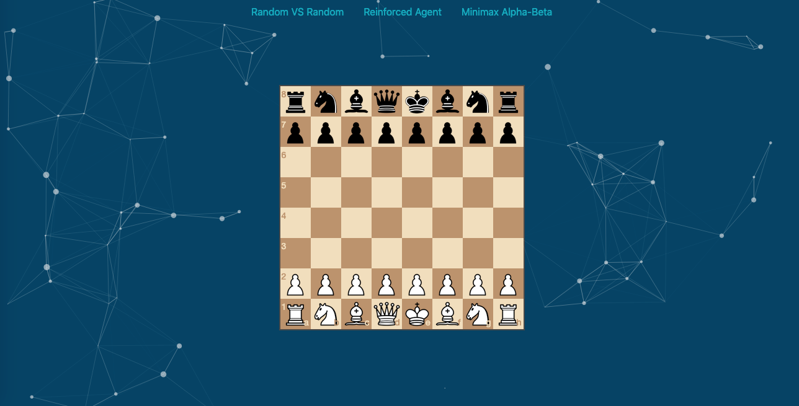

# Arcane Chess
> Web based and deep-q-learning powered chess game.

Arcane Chess is a modal based on a Deep Reinforcement Learning approach to master the chess game.
You can train your own Reinforced Agent and then deploy-it online and oppose him.



## Installation


Train your modal :
```sh
git clone https://github.com/raysr/Arcane-Chess
cd Arcane-Chess/app
python3.6 learning/train.py
```

Then deploy the local server :
```sh
cd Arcane-Chess/app
python3.6 
```

## Usage example

To play against your trained modal, deploy the local server, then just access http://localhost:5000/

## Development setup

To train your own version of Arcane Chess with specified hyperparameters, you first need some libraries :

```sh
pip3 install tensorflow keras flask numpy python-chess
```
Then you can execute the train script with optional parameters :
```sh
python3.6 learning/train.py --number_of_games 100000 --winner_reward 1 --loser_malus -1 --epsilon 1
                          --decremental_epsilon 0.0001 --gamma 0.05
```
Each of those ones are explained in the Approach section of this README.


## Approach
### Chess Game Representation :
 For the purpose of training, we need to represent 3 main aspect :
 * State(S)
 * Reward(R)
 * Action(A)
 * Quality(Q(Si, Ai))
### State : 
The choosen approach was to represent the current state as a numpy array of 64,  with each index of matrix representing the equivalent in the board.
For example : the case B2 in the board would be state[9]
In addition of that, to prepare the policy, we need to numerize the board pieces, for that we followed the classical chess piece value (which is relative to the player side ) :

            'Pawn':10,
            'Enemy Pawn':-10,
            'Queen':90,
            'Enemy Queen':-90,
            'Knight':30,
            'Enemy Knight':-30,
            'Rook':50,
            'Enemy Rook':-50,
            'Bishop':30,
            'Enemy Bishop':-30,
            'King':900,
            'Enemy King':-900,
            'None':0
So we can think of the evaluation of the board as the sum of all those evaluations, and that would help for the direct policy (heuristic).
### Reward :
The reward is the the center of a Reinforcement Learning approach, defining it is a stochastic process. We have multiple possibilites :
Defining a direct reward following the policy, but direct reward in chess isn't definable because of long-term strategies.
Then there is the Monte-Carlo method, based on a future reward, and that's what we used. We can represent this :
```
 	Reward_i := (Gamma*i) * Winner_Reward
```
**Gamma** : The time factor (decremental), we consider that the earlier we do a move, the less the impact it had.
And same goes for the loser :
```
	Malus_i := (Gamma*i) * Loser_Malus (negative value)
```
### Action :
This is simply the vector of all possible moves for the current player from the actual state.

### Quality :
This, is the factor that determines which move should the agent do, it represents the evaluation of quality for a given action Ai when on the state Si. Initialized with zeros it can be represented as a matrix where the columns are the actions and the lines are the states, then at each batch of games, is updated with the corresponding reward/malus.

### Random Factor :
When the training begins, all Q values are initialized with zeros, the first moves are choosed randomly, but after some iterations(games) the agent tends to permanently take the same moves, and with this simple approach it won't evaluate all the possibilites. That's why we added a random factor **Epsilon**, it determines the probability of a random transition or not ( Q-Based move ). And that factor have to decrement at each game, so the more games it played, the less it needs to try new moves and that's the **decremental_epsilon**. At the end of each game :
```
	epsilon := epsilon - decremental_epsilon
```

### Deep-Q-Network :
Chess is a complex game, and both the input and the target change constantly during the process and make training unstable. That's why we need to build a Deep Neural Network that would associate each (state_i,action_i) to a corresponding Q value. So we took a deep neural net of 4 Dense Layers, with an input of (65,) shape : 64 for the actual state, and the last index for a chosen move. When the agent randomly chose to take a Q-Dependant move : 
1. The modal predict the Q-value of each possible moves from this state.
2. Take the move maximizing this value
3. At the end of the game the modal train with a new batch :
	```
    modal.train_on_batch(state+modal.predict(state+moves)+reward)
	```

### Architecture of the project :
The project is divided on multiple sides :
* **Front-End** : The website use chessboardjs to create the board, and chessjs to generate the possible moves, each time the human-player do a move, the new state is send by AJAX to the back-end.
* **Back-End** : Flask deploy the webserver, serve the templates, when he receive a given state, he used python-chess to replicate this state then develop the possible moves, after that he call the modal to predict the corresponding Q-Values, take the best move and send a response to the Front-End with it.
* **Training** : The part where the magic comes, this is where the taken approach lives, the training games, rewards ...ect. you need to execute it at least once with some big number of games (1.000.000+) for then deploying your server.
### Possible Improvements :
* Use deeper neural networks, with multiple residual layers (avoiding vanishing gradients) to better associate with the complexity of chess game, but need more computational power.
* Improve the state, with recurrent factor : a state would be then represented by a vector of states that led to the final one ( need deeper neural network ).

## Libraries Used

* python-chess : to generate all the moves and simulate chess engine.
* Flask : forthe back-end webserver.
* Keras/TensorFlow : Frameworks used for the Deep Neural Network.
* chessjs/chessboardjs : for the front-end chess engine.

## Meta

Rayan Samy Ramoul – [https://github.com/raysr](https://github.com/raysr)

Distributed under the MIT license. See ``LICENSE`` for more information.


## Contributing

1. Fork it (<https://github.com/raysr/Arcane-Chess/fork>)
2. Create your feature branch (`git checkout -b feature/fooBar`)
3. Commit your changes (`git commit -am 'Add some fooBar'`)
4. Push to the branch (`git push origin feature/fooBar`)
5. Create a new Pull Request

